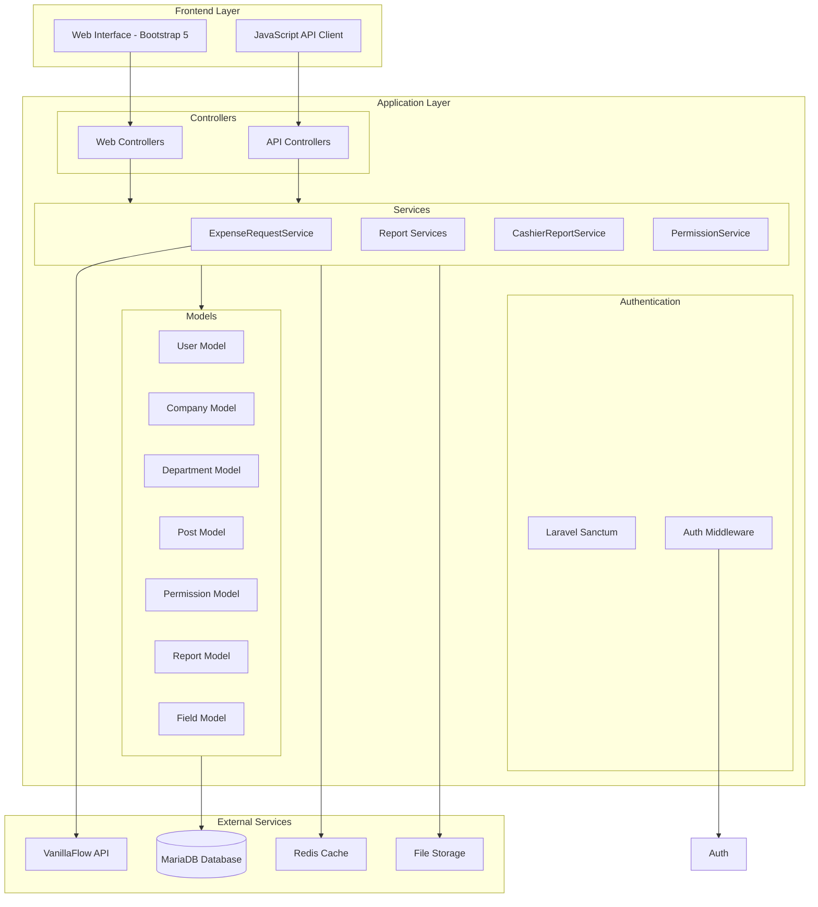
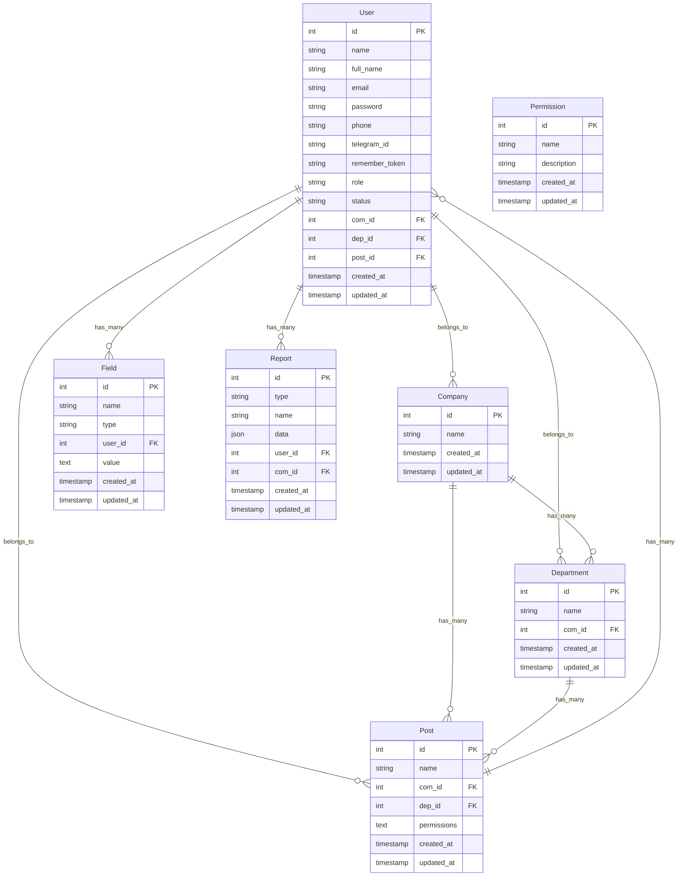
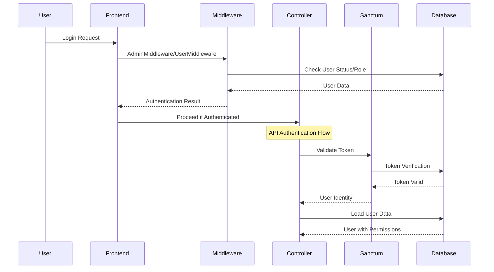
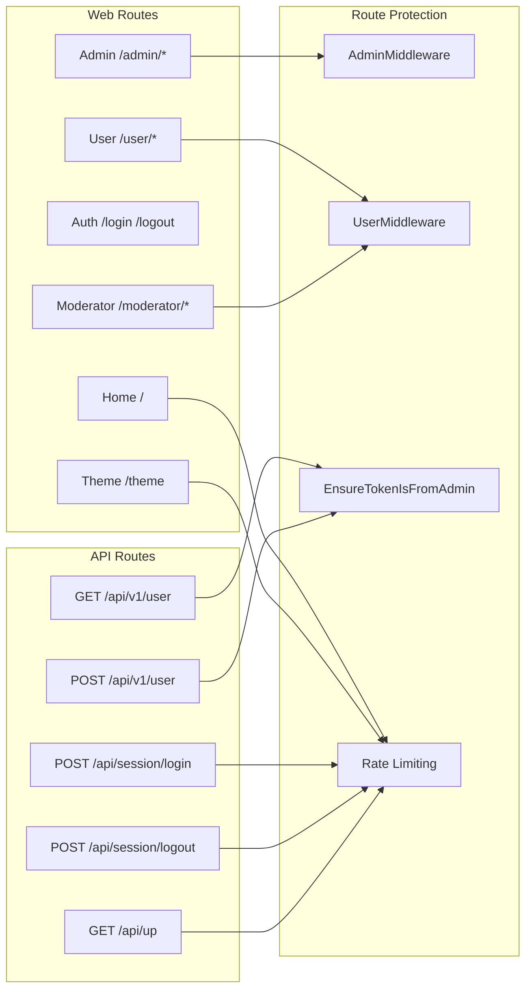
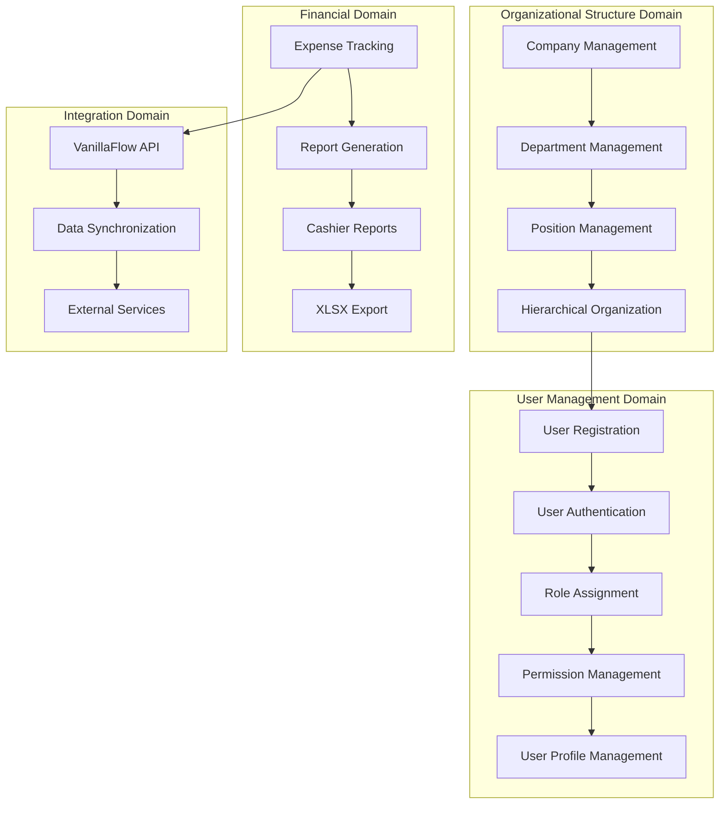
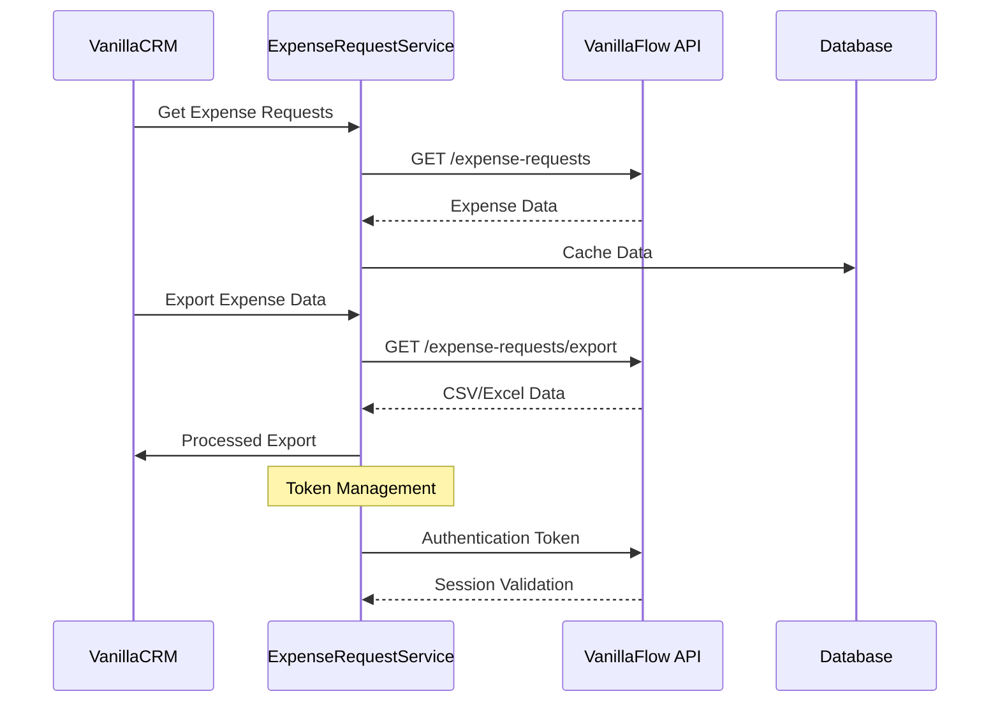
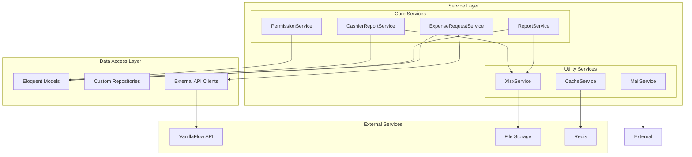
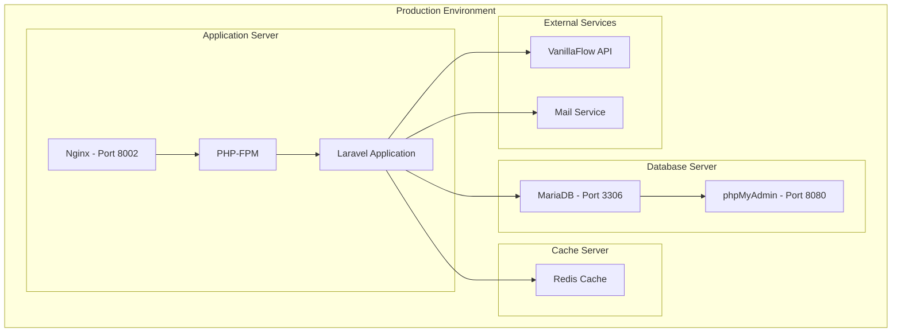
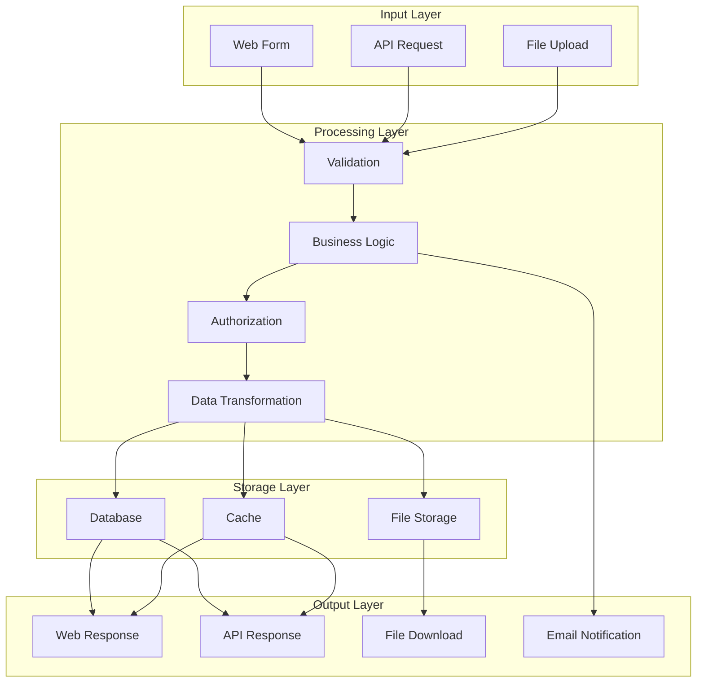
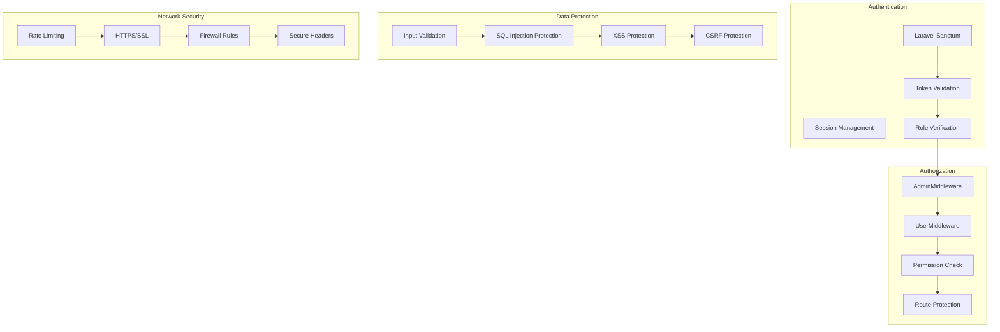

# VanillaCRM Architecture Documentation

## System Architecture Overview

## Database Schema Architecture

## Authentication Flow Architecture

## API Architecture

## Business Domain Architecture

## External Integration Architecture

## Service Layer Architecture

## Deployment Architecture

## Data Flow Architecture

## Security Architecture

